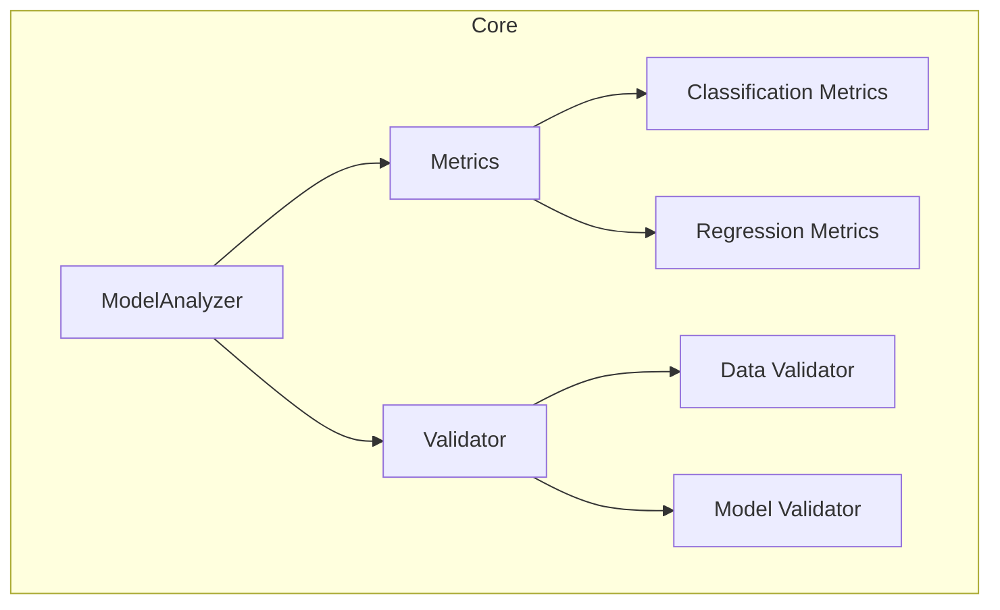
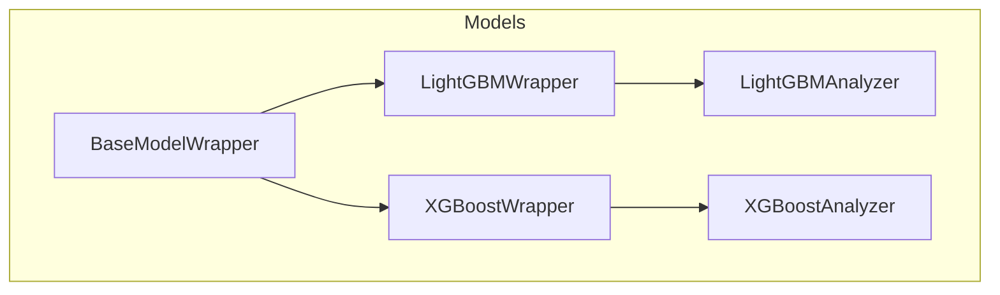
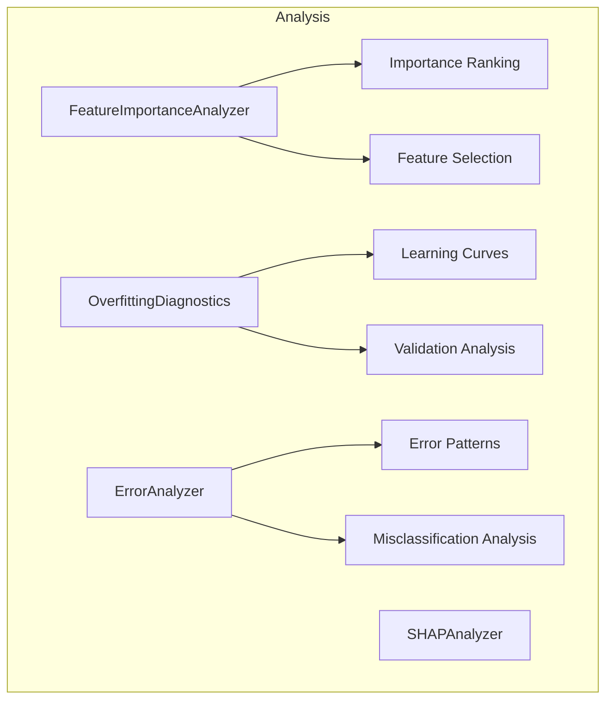
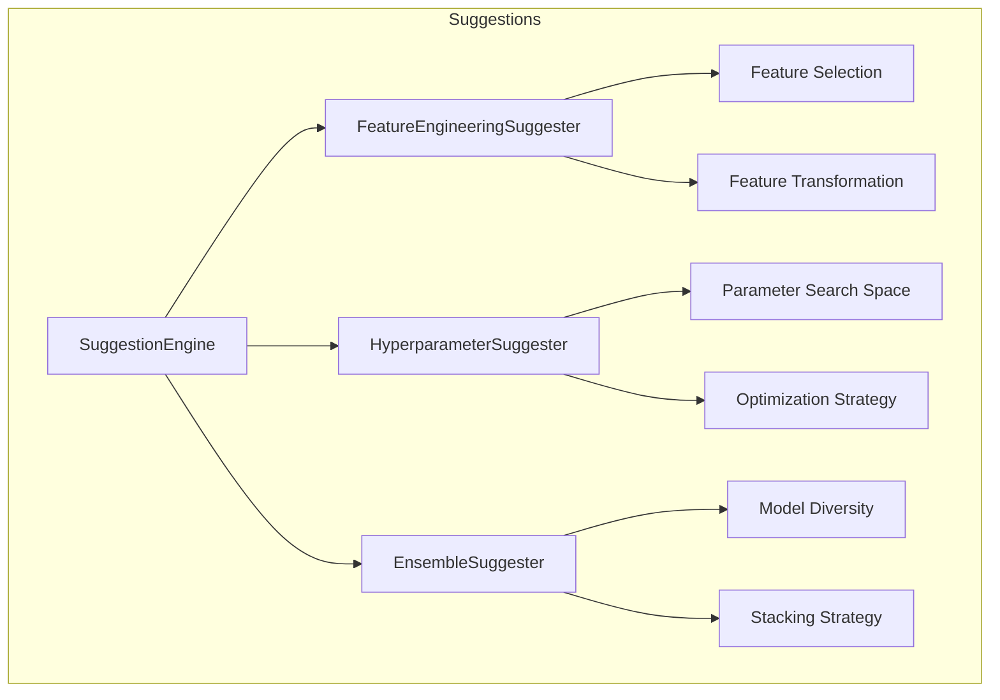
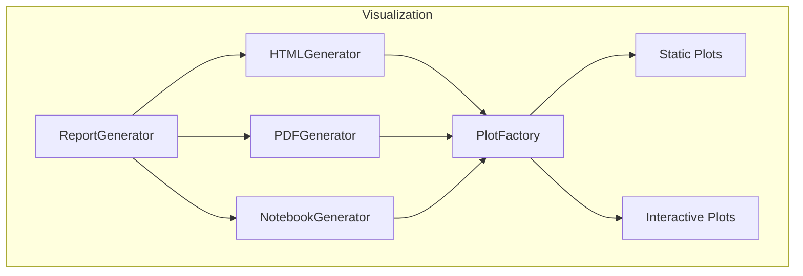
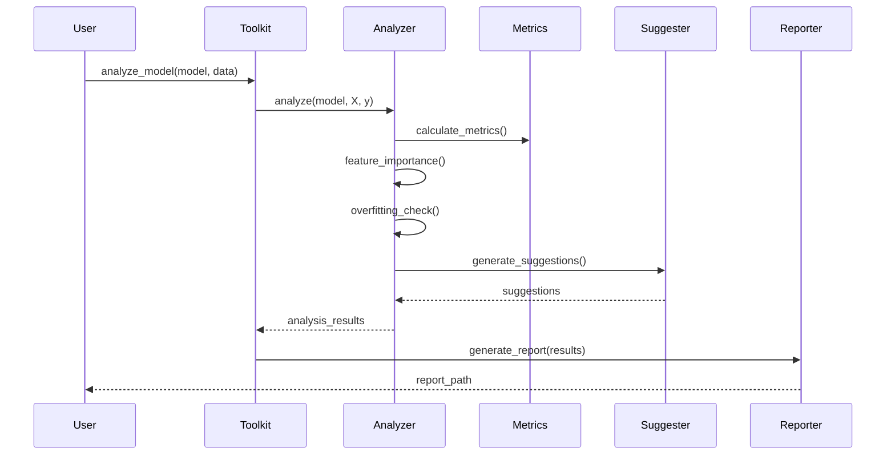
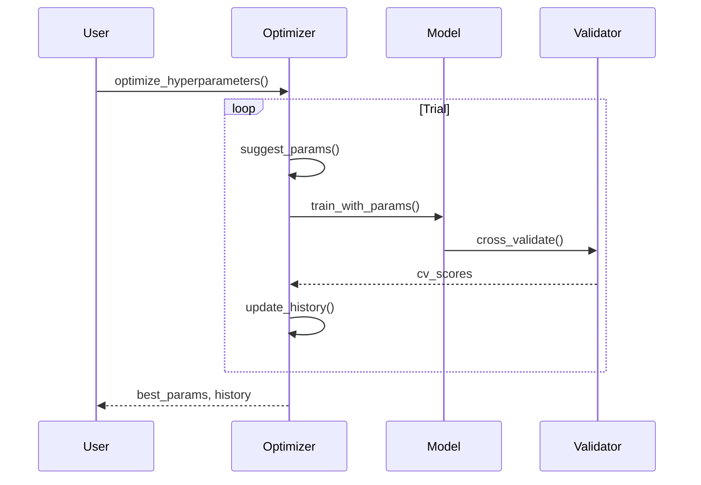

# Model Improvement Toolkit システムアーキテクチャ

**作成日**: 2025-07-19
**最終更新**: 2025-07-19
**関連文書**: [requirements.md](./requirements.md) | [design.md](./design.md)

## 1. アーキテクチャ概要

### 1.1 設計原則
- **Separation of Concerns**: 各モジュールは単一の責任を持つ
- **Dependency Inversion**: 高レベルモジュールは低レベルモジュールに依存しない
- **Open/Closed Principle**: 拡張に対して開き、修正に対して閉じた設計
- **Interface Segregation**: 必要最小限のインターフェースを提供
- **Don't Repeat Yourself**: コードの重複を避ける

### 1.2 レイヤーアーキテクチャ

```
┌─────────────────────────────────────────────────────────────┐
│                    Application Layer                          │
│  (CLI, API, Jupyter Integration)                            │
├─────────────────────────────────────────────────────────────┤
│                    Service Layer                             │
│  (ModelImprovementToolkit, Workflow Orchestration)          │
├─────────────────────────────────────────────────────────────┤
│                    Domain Layer                              │
│  (Analyzers, Suggesters, Report Generators)                 │
├─────────────────────────────────────────────────────────────┤
│                    Infrastructure Layer                       │
│  (Model Wrappers, Data Validators, Utilities)               │
└─────────────────────────────────────────────────────────────┘
```

## 2. コンポーネント詳細

### 2.1 Core Components



**ModelAnalyzer**
- 責務: モデル分析のオーケストレーション
- インターフェース: `analyze()`, `generate_report()`
- 依存: Metrics, Validator

**Metrics**
- 責務: パフォーマンスメトリクスの計算
- インターフェース: `calculate()`, `compare()`
- 実装: ClassificationMetrics, RegressionMetrics

**Validator**
- 責務: データとモデルの検証
- インターフェース: `validate()`, `check_compatibility()`
- 実装: DataValidator, ModelValidator

### 2.2 Model Wrappers



**BaseModelWrapper**
- 責務: モデル固有の機能を抽象化
- インターフェース: `predict()`, `get_params()`, `get_feature_importance()`

**LightGBMWrapper/XGBoostWrapper**
- 責務: フレームワーク固有の実装
- 特殊メソッド: フレームワーク固有の機能へのアクセス

### 2.3 Analysis Components



各分析コンポーネントは独立して動作し、結果をDictionary形式で返す。

### 2.4 Suggestion Engine



**SuggestionEngine**
- 責務: 改善提案の統合管理
- 優先順位付けと実行計画の生成

### 2.5 Visualization & Reporting



## 3. データフロー

### 3.1 基本的な分析フロー



### 3.2 ハイパーパラメータ最適化フロー



## 4. プラグインアーキテクチャ

### 4.1 拡張ポイント

```python
# プラグインインターフェース
class AnalyzerPlugin(ABC):
    @abstractmethod
    def analyze(self, model: Any, data: pd.DataFrame) -> Dict[str, Any]:
        pass
    
    @abstractmethod
    def get_name(self) -> str:
        pass

# プラグイン登録
class PluginRegistry:
    def register(self, plugin: AnalyzerPlugin):
        self._plugins[plugin.get_name()] = plugin
    
    def get_plugin(self, name: str) -> AnalyzerPlugin:
        return self._plugins.get(name)
```

### 4.2 カスタム分析の追加例

```python
class CustomFeatureAnalyzer(AnalyzerPlugin):
    def analyze(self, model: Any, data: pd.DataFrame) -> Dict[str, Any]:
        # カスタム分析ロジック
        return {"custom_metric": value}
    
    def get_name(self) -> str:
        return "custom_feature_analyzer"

# 使用方法
toolkit.register_plugin(CustomFeatureAnalyzer())
```

## 5. 設定管理

### 5.1 設定構造

```yaml
# config.yaml
model_improvement_toolkit:
  analysis:
    include_shap: true
    cross_validation_folds: 5
    importance_threshold: 0.01
  
  suggestions:
    hyperparameter_trials: 100
    feature_selection_method: "recursive"
    ensemble_max_models: 5
  
  visualization:
    plot_style: "seaborn"
    figure_size: [10, 6]
    save_plots: true
  
  performance:
    n_jobs: -1
    memory_limit: "8GB"
    chunk_size: 10000
```

### 5.2 環境変数

```bash
# 設定ファイルパス
MIT_CONFIG_PATH=/path/to/config.yaml

# ログレベル
MIT_LOG_LEVEL=INFO

# 並列処理設定
MIT_N_JOBS=4

# キャッシュ設定
MIT_USE_CACHE=true
MIT_CACHE_DIR=~/.mit_cache
```

## 6. エラー処理とロギング

### 6.1 エラー階層

```python
ModelImprovementError
├── ConfigurationError
│   ├── InvalidConfigError
│   └── MissingConfigError
├── AnalysisError
│   ├── InsufficientDataError
│   ├── ModelCompatibilityError
│   └── AnalysisTimeoutError
└── SuggestionError
    ├── NoImprovementPossibleError
    └── ConflictingSuggestionsError
```

### 6.2 ロギング戦略

```python
# ロガー階層
model_improvement_toolkit
├── model_improvement_toolkit.core
├── model_improvement_toolkit.analysis
├── model_improvement_toolkit.suggestions
└── model_improvement_toolkit.visualization

# ログフォーマット
[%(asctime)s] %(name)s - %(levelname)s - %(message)s
```

## 7. パフォーマンス最適化

### 7.1 並列処理

- クロスバリデーション: joblib parallel
- 特徴量重要度計算: multiprocessing
- ハイパーパラメータ探索: Optuna distributed

### 7.2 メモリ管理

- 大規模データセット: chunked processing
- 結果キャッシング: LRU cache
- メモリマップドファイル: numpy memmap

### 7.3 計算の最適化

- NumPy/Pandas vectorization
- Numba JIT compilation for hotspots
- Cython for critical paths

## 8. セキュリティ考慮事項

### 8.1 データ保護
- モデルとデータの分離保存
- 一時ファイルの安全な削除
- 機密情報のマスキング

### 8.2 実行環境の分離
- サンドボックス環境での実行
- リソース制限の実装
- 悪意のあるモデルの検出

## 9. 将来の拡張性

### 9.1 新しいMLフレームワークの追加
- CatBoost対応
- scikit-learn全般対応
- 深層学習フレームワーク対応

### 9.2 クラウド統合
- AWS SageMaker統合
- Azure ML統合
- Google Cloud AI Platform統合

### 9.3 AutoML機能
- 自動特徴量エンジニアリング
- ニューラルアーキテクチャサーチ
- メタ学習による最適化